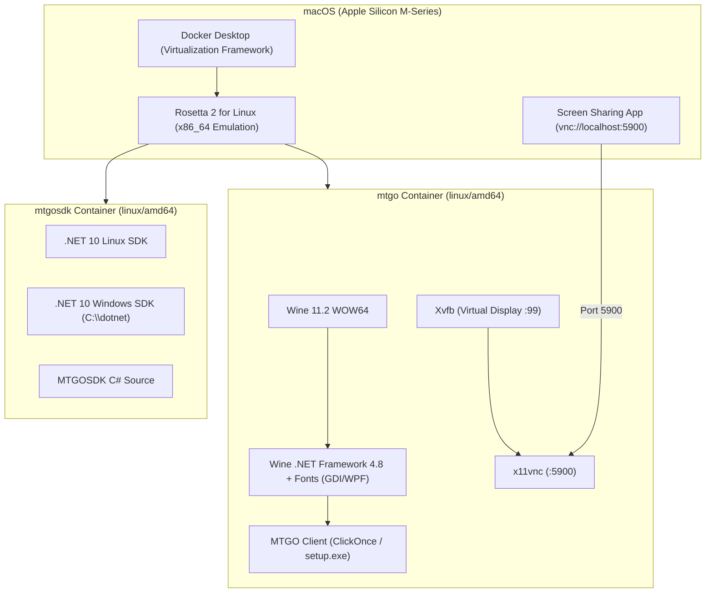

# MTGO Docker Support for Apple Silicon (M-Series Mac) - Implementation Plan

## 1. Executive Summary & Problem Statement

### 1.1 Context
This repository provides containerized environments (Wine + .NET + Xvfb/VNC/Wayland/X11) for running **Magic: The Gathering Online (MTGO)** and building applications with **MTGOSDK** on Linux and macOS.

### 1.2 The Problem
When attempting to build or run containers on Apple Silicon (M1/M2/M3/M4) Macs:
1. **Base Image Architecture**: `panard/wine:11.2-wow64` is published solely for `linux/amd64`.
2. **Missing Platform Tags**: Dockerfiles and `docker-compose.yml` lack explicit `--platform=linux/amd64` directives.
3. **Docker Engine Behavior**: Docker Desktop on Apple Silicon defaults to target `linux/arm64`, triggering build errors:
   ```text
   ERROR: failed to solve: panard/wine:11.2-wow64: no matching manifest for linux/arm64 in the manifest list entries
   ```
4. **Application Architecture**: MTGO is a legacy Windows x86/x64 application built on .NET Framework 4.8 (WPF) with a ClickOnce bootstrapper. It has no native ARM64 Windows version.

---

## 2. Technical Strategy: Emulation vs. Native ARM64

| Approach | Description | Pros | Cons | Recommendation |
| :--- | :--- | :--- | :--- | :--- |
| **Option A: `linux/amd64` via Docker + Rosetta 2** | Run `linux/amd64` container with Wine WOW64 using Apple's Rosetta 2 for Linux in Docker Desktop. | • Proven Wine + .NET 4.8 compatibility.<br>• Near-native execution speed with Rosetta 2.<br>• Minimal code changes required. | • Requires Rosetta 2 enabled in Docker Desktop. | **Primary / Recommended** |
| **Option B: Native `linux/arm64` + Box64 / FEX-Emu** | Run `linux/arm64` container with Box64/FEX-Emu user-space translation + Wine. | • No x86 VM kernel emulation needed. | • .NET Framework 4.8 WPF frequently fails to install or crashes.<br>• Extremely fragile setup and maintenance. | Not Recommended |

---

## 3. Architecture Overview



---

## 4. Repository Audit & Required Changes

### 4.1 `mtgo/Dockerfile`
- [ ] Add explicit `--platform=linux/amd64` to `FROM panard/wine:11.2-wow64`.
- [ ] Ensure winetricks installation steps (`dotnet48`, `corefonts`, `gdiplus`, `renderer=gdi`) succeed reliably under Rosetta emulation.

### 4.2 `mtgosdk/Dockerfile`
- [ ] Ensure `ARG BASE_IMAGE` uses `linux/amd64`.
- [ ] Verify that `dotnet-install.sh` downloads the `linux-x64` SDK when running under Rosetta.

### 4.3 `common.yml`
- [ ] Add `platform: linux/amd64` to base service definitions:
  - `x11-base`
  - `wayland-base`
  - `headless-base`

### 4.4 `mtgo/docker-compose.yml` & `mtgosdk/docker-compose.yml`
- [ ] Add `platform: linux/amd64` to all service definitions.
- [ ] Update build args and volume configurations if necessary for macOS permissions.

### 4.5 `.github/workflows/publish.yml`
- [ ] Update buildx workflow to specify `platforms: linux/amd64`.

### 4.6 `README.md`
- [ ] Update all `docker run` commands to include `--platform linux/amd64`.
- [ ] Add dedicated Apple Silicon (M-Series Mac) setup section:
  - How to enable Rosetta 2 in Docker Desktop.
  - Recommended memory allocation (at least 6–8 GB).
  - VNC connection guide using macOS built-in Screen Sharing.

---

## 5. Step-by-Step Implementation Plan

### Phase 1: Platform & Configuration Updates
1. Edit `mtgo/Dockerfile` and `mtgosdk/Dockerfile` to include `--platform=linux/amd64`.
2. Edit `common.yml`, `mtgo/docker-compose.yml`, and `mtgosdk/docker-compose.yml` to specify `platform: linux/amd64`.
3. Update `.github/workflows/publish.yml` with `platforms: linux/amd64`.

### Phase 2: Local Host Environment Verification
1. Verify Docker Desktop settings:
   - **General** > **Use Virtualization framework**: Checked.
   - **General** > **Use Rosetta for x86/amd64 emulation on Apple Silicon**: Checked.
   - **Resources** > **Memory**: Allocate at least 6 GB (8 GB recommended).
   - **Resources** > **CPUs**: Allocate at least 4 cores.

### Phase 3: Build & Baseline Testing
1. Build `mtgo-headless` locally:
   ```bash
   docker compose -f mtgo/docker-compose.yml build mtgo-headless
   ```
2. Start the headless container:
   ```bash
   docker compose -f mtgo/docker-compose.yml up -d mtgo-headless
   ```
3. Run environment diagnostics inside the container:
   ```bash
   docker exec -it mtgo-headless /usr/local/bin/check-env.sh
   ```

### Phase 4: MTGO Client & VNC Display Testing
1. Connect via macOS Screen Sharing:
   - Press `Cmd + Space` -> type `Screen Sharing`.
   - Connect to `vnc://localhost:5900`.
2. Trigger MTGO installation inside the container:
   ```bash
   docker exec -it mtgo-headless install-mtgo.sh
   ```
3. Verify MTGO launches and displays correctly on the virtual desktop:
   ```bash
   docker exec -it mtgo-headless mtgo
   ```

### Phase 5: MTGOSDK Build & Run Testing
1. Build `mtgosdk-headless`:
   ```bash
   docker compose -f mtgosdk/docker-compose.yml build mtgosdk-headless
   ```
2. Start the container and verify `wine-run` / `wine-shell` commands.

### Phase 6: Documentation & Final Polish
1. Update `README.md` with Apple Silicon instructions and troubleshooting tips.
2. Commit all changes to the repository.

---

## 6. Troubleshooting & Best Practices for Apple Silicon

- **Slow build during `winetricks dotnet48`**:
  Installing .NET 4.8 in Wine under emulation requires substantial CPU and disk I/O. Ensure Rosetta is active (not QEMU) and Docker has at least 6 GB of RAM assigned.
- **Display Resolution**:
  By default, `RESOLUTION=1280x1024x24`. If the MTGO window feels cramped, set `RESOLUTION=1920x1080x24` in `docker-compose.yml` or the `docker run` command.
- **Audio Crashes**:
  `xvfb-entrypoint.sh` automatically configures `WINE_AUDIO_DRIVER=pulse` or null ALSA to prevent MTGO's WPF audio engine from crashing when no physical sound device is present.
