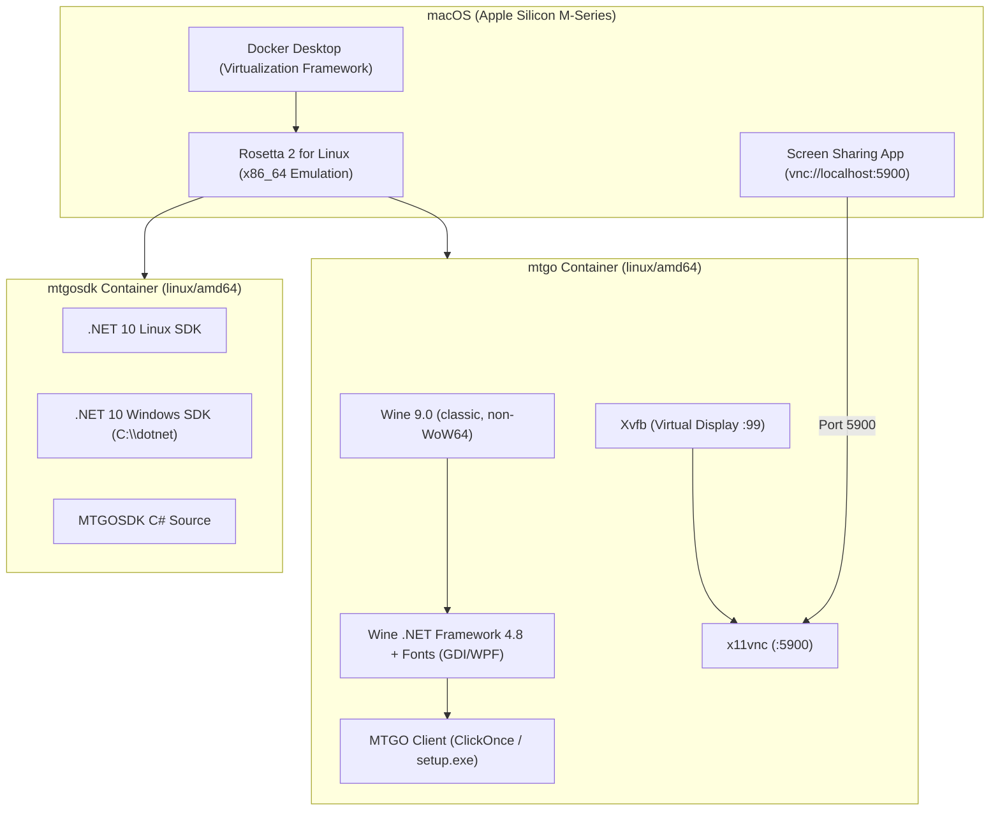

# MTGO Docker Support for Apple Silicon (M-Series Mac) - Implementation Plan

## 1. Executive Summary & Problem Statement

### 1.1 Context
This repository provides containerized environments (Wine + .NET + Xvfb/VNC/Wayland/X11) for running **Magic: The Gathering Online (MTGO)** and building applications with **MTGOSDK** on Linux and macOS.

### 1.2 The Problem
When attempting to build or run containers on Apple Silicon (M1/M2/M3/M4) Macs:
1. **Missing Platform Tags**: Dockerfiles and `docker-compose.yml` lacked explicit `--platform=linux/amd64` directives.
2. **Docker Engine Behavior**: Docker Desktop on Apple Silicon defaults to target `linux/arm64`, triggering build errors when a base image has no `linux/arm64` manifest.
3. **Application Architecture**: MTGO is a legacy Windows x86/x64 application built on .NET Framework 4.8 (WPF) with a ClickOnce bootstrapper. It has no native ARM64 Windows version.
4. **Wine WoW64 crash under Rosetta**: Wine's newer WoW64 architecture (≥10.8) crashes Rosetta 2 when spawning any 32-bit process, breaking MTGO's 32-bit ClickOnce bootstrapper. Resolved by switching `mtgo/Dockerfile` to `debian:bookworm-slim` + classic (non-WoW64) Wine 9.0 from WineHQ's apt repo, which ships a real i386 build alongside amd64.
5. **.NET Framework 4.7.2 install crash — UNRESOLVED**: even with classic Wine, installing .NET 4.7.2 (a hard MTGO prerequisite) crashes deterministically. See §6 "‎.NET Framework 4.7.2 cannot currently be installed" for full findings. This currently blocks getting MTGO to a playable state on Apple Silicon.

---

## 2. Technical Strategy: Emulation vs. Native ARM64

| Approach | Description | Pros | Cons | Recommendation |
| :--- | :--- | :--- | :--- | :--- |
| **Option A: `linux/amd64` via Docker + Rosetta 2** | Run `linux/amd64` container with Wine WOW64 using Apple's Rosetta 2 for Linux in Docker Desktop. | • Proven Wine + .NET 4.8 compatibility.<br>• Near-native execution speed with Rosetta 2.<br>• Minimal code changes required. | • Requires Rosetta 2 enabled in Docker Desktop. | **Primary / Recommended** |
| **Option B: Native `linux/arm64` + Box64 / FEX-Emu** | Run `linux/arm64` container with Box64/FEX-Emu user-space translation + Wine. | • No x86 VM kernel emulation needed. | • .NET Framework 4.8 WPF frequently fails to install or crashes.<br>• Extremely fragile setup and maintenance. | Not Recommended |

---

## 3. Architecture Overview



---

## 4. Repository Audit & Required Changes

### 4.1 `mtgo/Dockerfile` — partially done
- [x] Base switched to `debian:bookworm-slim` with explicit `--platform=linux/amd64` and classic Wine 9.0 (see §1.2.4), avoiding the WoW64 Rosetta crash entirely.
- [x] winetricks (`corefonts`, `gdiplus`, fonts, win7 mode) installs reliably under Rosetta via `xvfb-run`.
- [x] `mtgo_setup.exe` (the ClickOnce bootstrapper) baked into the image at build time; container's default command is `mtgo`, so `docker compose up` both installs (first run) and launches.
- [ ] **.NET Framework 4.7.2 — blocked, see §6.** Not installed at build time or runtime; MTGO's own installer prompt for it also fails. This is the current hard blocker to a fully "pull and play" experience.

### 4.2 `mtgosdk/Dockerfile` — done
- [x] `ARG BASE_IMAGE` resolves through `mtgo-runtime`, itself pinned to `--platform=linux/amd64`.
- [x] `dotnet-install.sh` targets `linux-x64` under Rosetta.

### 4.3 `common.yml` — done
- [x] `platform: linux/amd64` set on `x11-base`, `wayland-base`, `headless-base`.

### 4.4 `mtgo/docker-compose.yml` & `mtgosdk/docker-compose.yml` — done
- [x] `platform: linux/amd64` on all service definitions.
- [x] Host VNC ports split to `5901`/`5902` defaults to avoid conflicting with macOS's own port 5900 (Screen Sharing/AirPlay).

### 4.5 `.github/workflows/publish.yml` — done
- [x] buildx workflow specifies `platforms: linux/amd64`.

### 4.6 `README.md` — done
- [x] Apple Silicon (M-Series Mac) setup section added.
- [x] `docker run` quick-start examples use `--platform linux/amd64` and host port `5901`.
- [x] `VNC_PASSWORD` documented in the configuration table.

---

## 5. Step-by-Step Implementation Plan

### Phase 1: Platform & Configuration Updates
1. Edit `mtgo/Dockerfile` and `mtgosdk/Dockerfile` to include `--platform=linux/amd64`.
2. Edit `common.yml`, `mtgo/docker-compose.yml`, and `mtgosdk/docker-compose.yml` to specify `platform: linux/amd64`.
3. Update `.github/workflows/publish.yml` with `platforms: linux/amd64`.

### Phase 2: Local Host Environment Verification
1. Verify Docker Desktop settings:
   - **General** > **Use Virtualization framework**: Checked.
   - **General** > **Use Rosetta for x86/amd64 emulation on Apple Silicon**: Checked.
   - **Resources** > **Memory**: Allocate at least 6 GB (8 GB recommended).
   - **Resources** > **CPUs**: Allocate at least 4 cores.

### Phase 3: Build & Baseline Testing
1. Build `mtgo-headless` locally:
   ```bash
   docker compose -f mtgo/docker-compose.yml build mtgo-headless
   ```
2. Start the headless container:
   ```bash
   docker compose -f mtgo/docker-compose.yml up -d mtgo-headless
   ```
3. Run environment diagnostics inside the container:
   ```bash
   docker exec -it mtgo-headless /usr/local/bin/check-env.sh
   ```

### Phase 4: MTGO Client & VNC Display Testing
1. Connect via macOS Screen Sharing:
   - Press `Cmd + Space` -> type `Screen Sharing`.
   - Connect to `vnc://localhost:5900`.
2. Trigger MTGO installation inside the container:
   ```bash
   docker exec -it mtgo-headless install-mtgo.sh
   ```
3. Verify MTGO launches and displays correctly on the virtual desktop:
   ```bash
   docker exec -it mtgo-headless mtgo
   ```

### Phase 5: MTGOSDK Build & Run Testing
1. Build `mtgosdk-headless`:
   ```bash
   docker compose -f mtgosdk/docker-compose.yml build mtgosdk-headless
   ```
2. Start the container and verify `wine-run` / `wine-shell` commands.

### Phase 6: Documentation & Final Polish
1. Update `README.md` with Apple Silicon instructions and troubleshooting tips.
2. Commit all changes to the repository.

---

## 6. Troubleshooting & Best Practices for Apple Silicon

### .NET Framework 4.7.2 cannot currently be installed — UNRESOLVED

MTGO hard-requires .NET Framework 4.7.2. Three independent install paths were
tested (2026-09-18/19) on Wine 9.0 classic + Docker Desktop with Rosetta
enabled, and **all three fail**:

1. **`winetricks dotnet472`** — this verb doesn't install 4.7.2 directly; it
   forces a prerequisite chain (`dotnet40 → 45 → 46 → 461 → 462 → 472`). It
   dies on the very first link, `dotnet40`'s installer
   (`dotNetFx40_Full_x86_x64.exe /q /c:install.exe /q`), while extracting
   resource files, with:
   ```
   rosetta error: invalid gdt selector index 5
   wine: Unhandled illegal instruction at address 7FB73CF6 (thread 01b0), starting debugger...
   ```
   `winedbg` then attaches on the crash and hangs indefinitely waiting on
   stdin (no GUI dialog appears because `ShowCrashDialog=0` is set, but the
   debugger still starts and blocks). The process never exits or times out on
   its own.

2. **MTGO's own installer prompt** — running `mtgo` (i.e. `wine
   mtgo_setup.exe`) triggers MTGO's bundled prerequisite installer, which
   downloads and runs `NDP472-KB4054531-Web.exe` → `Setup.exe /x86 /x64
   /web`. Clicking "Accept" on the EULA and watching it over VNC: it reaches
   "Installing Microsoft .NET Framework 4.7.2 (x86 and x64)..." and then
   **deadlocks silently** — zero CPU time and zero network bytes moved for
   90+ seconds, no crash text at all. This has no Rosetta fingerprint and
   looks like Wine 9.0 classic's split 32-bit/64-bit process model failing
   the installer's x86/x64 chaining handoff.

3. **Standalone offline installer, bypassing both chains** — winetricks'
   source (`w_download` in `/usr/local/bin/winetricks`) gives the official
   URL and correct invocation for the offline package:
   ```bash
   wget https://download.visualstudio.microsoft.com/download/pr/1f5af042-d0e4-4002-9c59-9ba66bcf15f6/089f837de42708daacaae7c04b7494db/NDP472-KB4054530-x86-x64-AllOS-ENU.exe
   # sha256: 5cb624b97f9fd6d3895644c52231c9471cd88aacb57d6e198d3024a1839139f6
   WINEDLLOVERRIDES=fusion=b wine NDP472-KB4054530-x86-x64-AllOS-ENU.exe /sfxlang:1027 /q /norestart
   ```
   Run directly (skipping the dotnet40-462 chain entirely), this gets much
   further — real CPU activity, past resource extraction, into actual MSI
   installation — but then **crashes at the exact same instruction address**
   as failure #1:
   ```
   wine: Unhandled illegal instruction at address 7FB73CF6 (thread 020c), starting debugger...
   ```

**The identical crash address (`7FB73CF6`) in two completely different
executables (`dotNetFx40_Full_x86_x64.exe` and
`NDP472-KB4054530-x86-x64-AllOS-ENU.exe`) is the key finding**: this is not
installer- or version-specific. It's a shared Wine/system code path — likely
the WiX/Burn bootstrapper's resource-extraction routine that all of these
.NET installers use — hitting one deterministic Rosetta 2 bug. Picking a
different .NET installer or version will not route around it.

Also confirmed during this investigation: **Rosetta 2 only translates
x86_64.** Every 32-bit process (anything using classic Wine's `wine`
binary, not `wine64`) runs under `qemu-i386` regardless of the Rosetta
setting — Apple never built 32-bit Rosetta support. This is inherent to
Apple Silicon, not a misconfiguration, and it's the main reason 32-bit
installers (fonts, ClickOnce bootstrap, .NET) are so much slower than the
64-bit Windows services (`services.exe`, `explorer.exe`, etc.), which do run
Rosetta-accelerated and start in seconds.

**Unresolved paths worth trying next, none confirmed:**
- Test on real x86_64 hardware/VM (not Apple Silicon at all) — the one
  experiment that would separate "Rosetta-only" from "Wine-9.0-classic-only."
  Failure #1 (explicit Rosetta error) would likely disappear; whether
  failure #2/#3's crash also disappears is the open question.
- Try a different Wine version. Risky: Wine 9.0 was deliberately pinned
  below the point where WoW64 became mandatory specifically to dodge a
  *different* Rosetta crash (§1.2.4) — changing the Wine version could
  reintroduce that bug while (maybe) fixing this one.
- Find a .NET 4.7.2 redistributable packaged without the WiX/Burn
  bootstrapper (e.g. a raw MSI extracted ahead of time), since the crash
  appears to live in that shared bootstrapper layer, not in .NET itself.

**Practical consequence:** as of this writing, a freshly built/pulled
`videreproject/mtgo:headless` image has working Wine + fonts + win7 mode +
gdiplus, and auto-installs/launches MTGO's own bootstrapper — but the
container cannot reach a playable MTGO session on Apple Silicon until this
.NET installer crash is solved. This is the current #1 blocker for the
"pull the image and play" goal.

### Other known issues

- **Host memory pressure during winetricks fonts**: the `corefonts` /
  `win7` / `gdiplus` winetricks step is CPU/IO heavy and can push host free
  memory low enough that macOS OOM-kills the build. Ensure Docker Desktop has
  at least 6-8 GB RAM assigned and close other memory-heavy apps before a
  fresh build; watch `vm_stat` free pages if a build seems to stall.
- **Volume seeding gotcha**: `/home/wine/.wine` is a named Docker volume
  (`wine-data-headless`, etc.). Docker only seeds a volume from the image's
  baked content when the volume is **empty**. Rebuilding the image after
  changing anything baked into `.wine` (fonts, wine version, a future .NET
  fix) will NOT reach an existing non-empty volume — run `docker compose -f
  mtgo/docker-compose.yml down -v` first to force a fresh seed.
- **Display Resolution**:
  By default, `RESOLUTION=1280x1024x24`. If the MTGO window feels cramped, set `RESOLUTION=1920x1080x24` in `docker-compose.yml` or the `docker run` command.
- **Audio Crashes**:
  `xvfb-entrypoint.sh` automatically configures `WINE_AUDIO_DRIVER=pulse` or null ALSA to prevent MTGO's WPF audio engine from crashing when no physical sound device is present.
